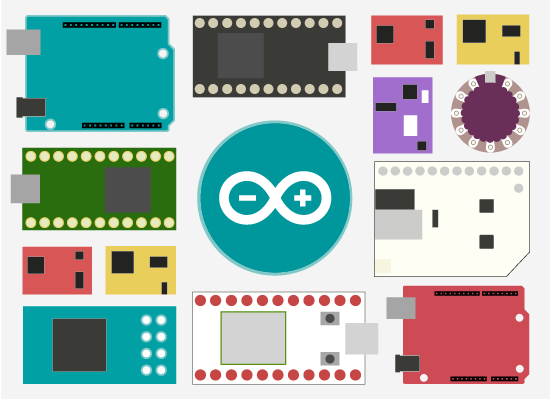
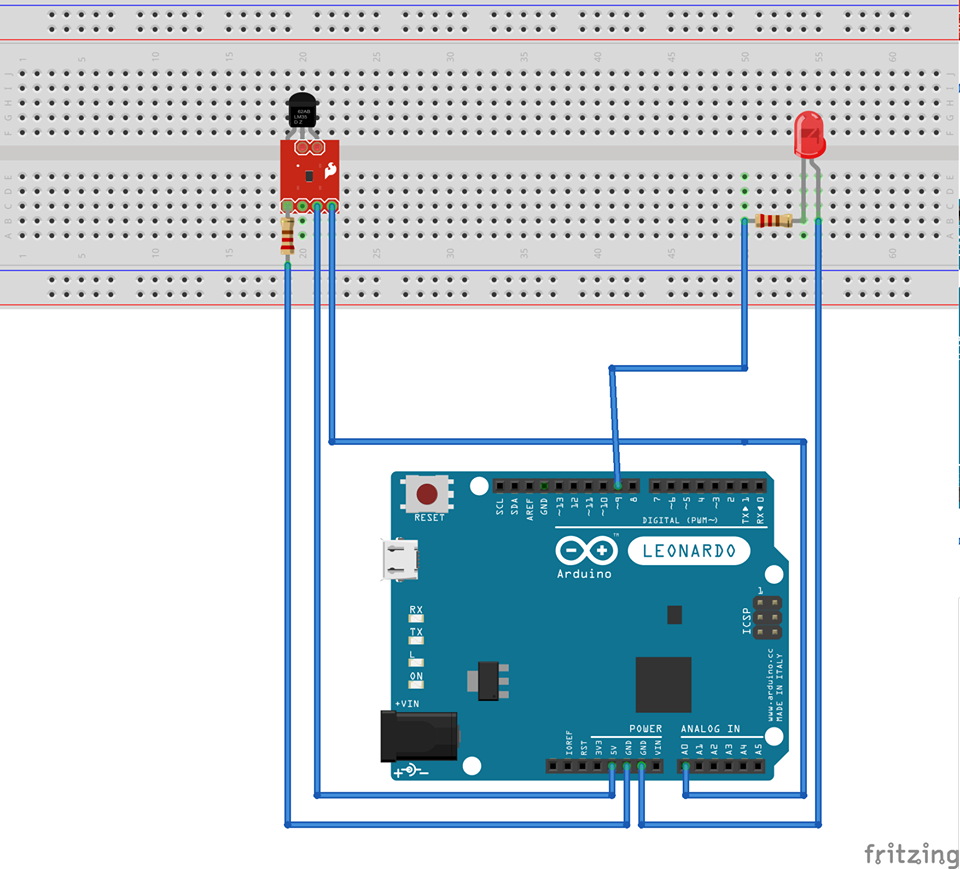

# Projetarduino
Réalisé par : 
Aboubeker RAHMANI

Ce projet consiste à détecter une flamme à l’aide d’un capteur branché à une carte Arduino comme le montre le câblage dans la figure ci-dessous .Il permet de capter les températures externes  et  les envoyer  à la carte puis les transmettre à un ordinateur.

# Cablage

